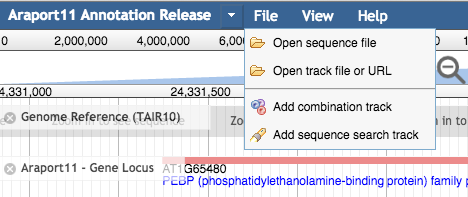
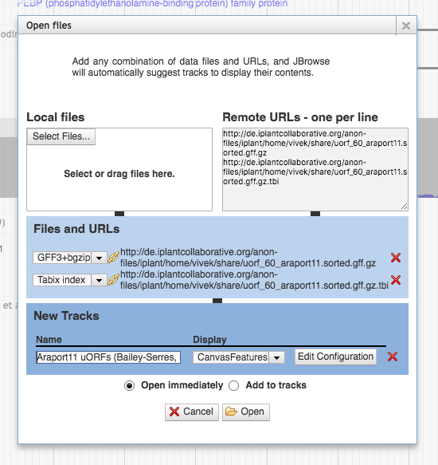

Arabidopsis Information Portal
* * *

Viewing remotely-located indexed GFF3 files in JBrowse
---

The following document explains the steps to prepare and upload *tabix*-indexed *GFF3* files into the *CyVerse Data Store* and visualize the data in a Genome Browser instance like *JBrowse*.

#### Background information

+ [GFF3](http://www.sequenceontology.org/gff3.shtml): *Generic Feature Format Version 3* is a 9-column TAB-delimited format used to represent genomic features, allowing for hierarchical grouping of features, with feature types based on a controlled vocabulary called Sequence Ontology (SO).

+ [tabix](http://www.htslib.org/doc/tabix.html): `tabix` is a generic indexing tool for TAB-delimited genomic feature files like GFF3, VCF, BED, etc.  
    - Depends on the `bgzip` Block compression/decompression utility


+ [CyVerse](http://www.cyverse.org): An NSF-funded, community-driven, cyber-infrastructure initiative providing access to powerful computational infrastructure to scientist in the form of high performance computing and storage systems. The *CyVerse Data Store* is a cloud-based storage system that enables researchers to store and share data related to their research.

* [JBrowse](http://gmod.org/wiki/JBrowse): Fast, scalable, customizable, client-side genome browser with a fully dynamic AJAX interface.

#### Requirements

+ Familiarity with the Unix command line
+ *CyVerse* User Account: <https://user.cyverse.org/register/>
+ [HTSlib](http://www.htslib.org/download/) package, containing `bgzip` and `tabix` executables: Download latest release of HTSlib from <https://github.com/samtools/htslib/releases/latest>

	```
#### download, extract and build the package
#### add folder to PATH
$ wget https://github.com/samtools/htslib/releases/download/1.3.1/htslib-1.3.1.tar.bz2
$ tar jxvf htslib-1.3.1.tar.bz2
$ cd htslib-1.3.1
$ make
$ export PATH=$PWD/htslib-1.3.1:$PATH
	```

+ [Genometools](http://genometools.org/) package to pre-process GFF3 file for tabix compatibility: Download latest release from <http://genometools.org/pub/binary_distributions>

	```
#### download and extract the package
#### then, add folder(s) to PATH and LD_LIBRARY_PATH
$ wget http://genometools.org/pub/binary_distributions/gt-1.5.8-Linux_x86_64-64bit-barebone.tar.gz
$ tar zxvf gt-1.5.8-Linux_x86_64-64bit-barebone.tar.gz
$ export PATH=$PWD/gt-1.5.8-Linux_x86_64-64bit-barebone/bin:$PATH
$ export LD_LIBRARY_PATH=$PWD/gt-1.5.8-Linux_x86_64-64bit-barebone/lib:$LD_LIBRARY_PATH
	```

+ [icommands](https://docs.irods.org/master/icommands/user/): Collection of commands for Unix systems that are used to interact with the CyVerse Data Store. Download the relevant package from <https://pods.iplantcollaborative.org/wiki/x/wIpm>

	```
#### download and extract the package
#### then, add folder to PATH
$ wget https://pods.iplantcollaborative.org/wiki/download/attachments/6720192/icommands-3.3.1-linux-autobuf.tgz
$ export PATH=$PWD/icommands-3.3.1-linux-autobuf/bin:$PATH
	```
	
+ [JBrowse v1.12.2](https://github.com/GMOD/jbrowse/releases): The latest release of JBrowse v1.12.2 is required, since it enables support for GFF3 + Tabix Indexed genomic feature format files.

#### Steps

The steps below, outlines the procedure followed to process, store and visualize a community-generated dataset via the Araport JBrowse genome browser instance. In this example, we are going to work a GFF3 file representing annotated upstream ORFs (uORFs) bound by ribosomes (*Bailey-Serres, Bazin, and Girke, personal communication*).

Original Data File: <http://biocluster.ucr.edu/~tgirke/projects/Julia_RFP-Seq_2015/uorf_60_araport11.gff>

+ **Step 1**: Pre-process the GFF3 file.
    + Make sure that the features in the GFF3 file are sorted by chromosome start coordinates.
    + Make sure that the file does not contain any blank line(s).

	```
$ wget http://biocluster.ucr.edu/~tgirke/projects/Julia_RFP-Seq_2015/uorf_60_araport11.gff
#### For simple GFF3 files, we will use unix `sort` to organize the features
$ sort -k1,1 -k4,4n uorf_60_araport11.gff -o uorf_60_araport11.sorted.gff
	```

***Note***: In this situation above, the input GFF3 file is simple (lacking any hierarchical features). For more complicated GFF3 files, with multi-level feature hierarchies, we can use the genometools package, like so: `gt gff3 -sortlines -tidy -retainids -addids no -checkids yes input.gff > input.sorted.gff`

+ **Step 2**: Compress and index the GFF3.
    + If the above step completed successfully, tabix should have no issues building an index of the GFF3 file contents.

	```
#### compress the GFF3 file using bgzip
#### then, index the GFF3 using tabix
$ bgzip uorf_60_araport11.sorted.gff
$ ls
uorf_60_araport11.sorted.gff   uorf_60_araport11.sorted.gff.gz
$ tabix -p gff uorf_60_araport11.sorted.gff.gz
	```

+ **Step 3**: Connect to the CyVerse Data Store via iCommands, [instructions available here](https://pods.iplantcollaborative.org/wiki/x/wIpm).  
***Note***: In the steps below, please substitute the string `vivek` with your CyVerse username.

	```
#### Go through first-time initialization of iRODS environment
$ iinit
Enter the host name (DNS) of the server to connect to:data.iplantcollaborative.org
Enter the port number:1247
Enter your irods user name:vivek
Enter your irods zone:iplant
Those values will be added to your environment file (for use by other i-commands) if the login succeeds.
Enter your current iRODS password:
$ ipwd
/iplant/home/vivek
	```
	If you see an output from the `ipwd` command, the iRODS environemnt initialization was successful.  
	**Please note**: This step needs to be completed only one-time, or after changing configuration.
	
+ **Step 4**: Push the `tabix`-indexed GFF3 into the CyVerse Data Store and change permissions to enable `anonymous` access.

	```
#### transfer local file onto the remote CyVerse data store directory
$ ls *gz*
uorf_60_araport11.sorted.gff.gz   uorf_60_araport11.sorted.gff.gz.tbi
$ imkdir share
$ icd share
$ iput -V uorf_60_araport11.sorted.gff.gz
$ iput -V uorf_60_araport11.sorted.gff.gz.tbi
$ ils
/iplant/home/vivek/share:
	uorf_60_araport11.sorted.gff.gz
	uorf_60_araport11.sorted.gff.gz.tbi
#### change permissions on folder(s)/file(s) to allow `anonymous` access
$ ichmod -rV read anonymous /iplant/home/vivek/share
	```
+ **Step 5**: Prepare anonymous access URLs for files uploaded to CyVerse Data Store

The CyVerse Data Store presents files for HTTP access via the following URL prefix: **http://de.iplantcollaborative.org/anon-files/**

Based on this, the URLs to access our GFF3 file + Tabix index will be as follows:

```
http://de.iplantcollaborative.org/anon-files/iplant/home/vivek/share/uorf_60_araport11.sorted.gff.gz
http://de.iplantcollaborative.org/anon-files/iplant/home/vivek/share/uorf_60_araport11.sorted.gff.gz.tbi
```

+ **Step 6**: Temporarily load the files and view on the Araport JBrowse instance
	+ Visit Araport JBrowse: [https://apps.araport.org/jbrowse/?data=arabidopsis](http://jcvi06.tacc.utexas.edu/jbrowse-1.12.2/?data=arabidopsis)
	
	+ Navigate to the ***File*** menu and choose the ***Open track file or URL*** option.  
	  
	
	+ Copy and paste the anonymous access URLs into the ***Remote URLs - one per line*** text box. Once JBrowse recognizes valid URLs, the ***Files and URLs*** panel (located in the middle) will be updated, and simultaneously the ***New tracks*** panel (located at the bottom) updates with a new track entry showing an auto-populated track label, track glyph type and controls for advanced configuration.  
	  
	You can repeat the above steps multiple times to add one or more files of interest.
	
	+ Once all files have been staged, either choose ***Open Immediately*** to see the data promptly after clicking the **Open** button or choose ***Add to tracks*** to populate the track selector on the left hand side of the JBrowse window with a list of remotely loaded resources (it will appear at the top of the list, under the category named ***Local tracks***).  
	
		***Please note***: Any tracks loaded using the method described above are only available in that session. When the browser window is refreshed or a new instance/session is opened up in an alternate window/tab, the original set of remote tracks will not be carried over.
	
+ **Step 7**: Set up a persistent track in the Araport JBrowse instance
	+ In order to ensure that your tracks persist and can be shared with the broader community, the Araport team can add your track(s) to the manifest of currently available tracks on the Araport JBrowse instance.
	
	+ Prepare a JBrowse compatible config file referencing the GFF3 files, as shown below. In the configuration snippet, modify the following attributes:
		- `key`: Brief description of your track data.
		- `urlTemplate`: the path to your GFF3 file on the CyVerse Data Store.
	
	```
[tracks.uORFs+Araport11]
storeClass  = JBrowse/Store/SeqFeature/GFF3Tabix
type        = JBrowse/View/Track/CanvasFeatures
category    = Community Data Tracks
key         = Araport11 Upstream ORFs (Bailey-Serres et al., Personal Communication)
urlTemplate = http://de.iplantcollaborative.org/anon-files/iplant/home/vivek/share/uorf_60_araport11.sorted.gff.gz
	```  
	
	+ Push the config file into the **CyVerse Data Store** and change permissions to enable `anonymous` access
	
	```
#### transfer local file onto the remote CyVerse data store directory
$ ls *.conf
uorf_tracks.conf
$ icd /iplant/home/vivek/share
$ iput uorf_tracks.conf
$ ichmod read anonymous uorf_tracks.conf
$ ils
	uorf_60_araport11.sorted.gff.gz
	uorf_60_araport11.sorted.gff.gz.tbi
	uorf_tracks.conf
```

	+ Share the path to your track config file via the [Araport Contact Us Form](https://www.araport.org/contact-us/) or via email to <mailto:araport@jcvi.org>

* * *

If you have any questions regarding the process described above, please write to <mailto:araport@jcvi.org>
